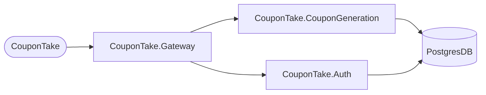

# Coupon Take
A complete solution to redeem random codes from a web API, the back-end was made in ASP.NET and the front-end in Flutter.

## Techs
- Flutter
- ASP.NET
  - Ocelot
  - JWT
  - Argon2
- EntityFramework
- Docker
- Postgres

## Setup
You will need Docker, Docker Compose and OpenSSL to setup and run the project.
Flutter will be used to build the project for web, there is no good Flutter image to get the job done, so we ganna do by own. If you are running in a enviroment that don't have Flutter and don't want to install you can just skip the [step](https://github.com/LuanRoger/CouponTake#build-the-flutter-project-for-the-web), on the [actions](https://github.com/LuanRoger/CouponTake/actions) tab you will find project builds that you can just download, but is highly recommended that you build by your self.
[](https://github.com/LuanRoger/CouponTake/actions/workflows/flutter_web_build.yml)

The Docker will be used to build the images and run the containers and the Docker Composer is to create a cluster with all APIs and services running on.
The OpenSSL is just to create the RSA keys used by ```CouponTakeInfra.Auth``` to sign the JWTs.

### Clone the repository
```bash
git clone https://github.com/LuanRoger/CouponTake.git
cd CouponTake
```

### Build the Flutter project for the web
```bash
flutter build web --release
```
> NOTE: At the actual moment is preferable that the project is builded by Flutter in the **beta** channel, because some widget is not themed for Material 3 in the stable channel.

### Create the the certificates
Firs create the path to store the public and private key that will be used to sign the JWTs.
Create a folder called ```certificates``` on the ```CouponTake/CouponTakeInfra/``` path:
```bash
mkdir CouponTakeInfra/certificates
cd CouponTakeInfra/certificates
```
Create the both public and private RSA key from thre:
```bash
openssl genrsa -out jwt-auth-priv-key.pem 4096
openssl rsa -in jwt-auth-priv-key.pem -pubout -out jwt-auth-pub-key.pem
```
Those keys will be copied to the container.

### Build
Before build check the .env file and change if needed.
Back to the root of the project (```/CouponTake```), build and start all the services with Docker Compose:
```bash
docker-compose up -d
# OR
docker compose up -d
```
There is a Dockerfile for each service used by ```docker-compose.yaml``` and you can build and run just what you want.
```bash
docker build -t <tag> -f <Dockerfile> .
```
> Enter with the tag name that you prefer

### Dockerfiles
- CouponTake (front-end): ```CouponTake/Dockerfile```
- CouponTakeInfra.Gateway: ```CouponTake/CouponTakeInfra/Auth.Dockerfile```
- CouponTakeInfra.Auth: ```CouponTake/CouponTakeInfra/Gateway.Dockerfile```
- CouponTakeInfra.CouponGeneration: ```CouponTake/CouponTakeInfra/CouponGeneration.Dockerfile```

If you choose to build and run each Dockerfile by own, keep in mind that you will need to pull the [Postgres image from DockerHub](https://hub.docker.com/_/postgres)

## Projects overview
**CouponTake (front-end/root)** is the UI to communicate with the APIs/infrastructure, and the entrypoint for it is the **CouponTakeInfra.Gateway** that uses [Ocelot](https://github.com/ThreeMammals/Ocelot) to redirect the request to the right service.

One of them is **CouponTakeInfra.Auth** responsable to login and sign a user, it uses JWT to authorize the request. He also use Argon2 to to encript the user's password to store into Postgres.
The last one is the **CouponTakeInfra.CouponGeneration**, this service just create a new coupon code (aka GUID lol) and get informations from the database about it.


## Screenshots
| Screenshot                                                                           |
|--------------------------------------------------------------------------------------|


## ☁️ Deploy
You can easily deploy this project at DigitalOcean.

[](https://www.digitalocean.com/?refcode=dddd7d890760&utm_campaign=Referral_Invite&utm_medium=Referral_Program&utm_source=badge)
